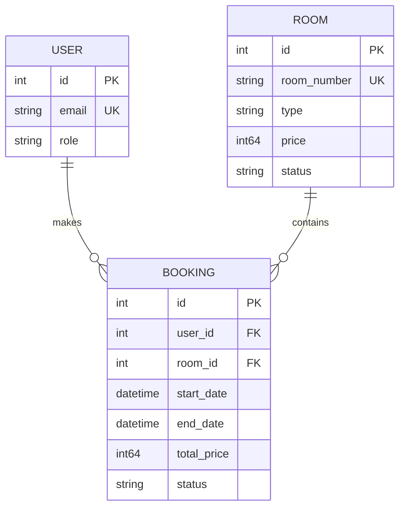

# Data Models & Schema

The system uses a PostgreSQL database with a schema managed by `golang-migrate` and data access code generated by `sqlc`.

## 🧬 Core Entities

### User
Represents an identity in the system with specific permissions.
- **ID**: Serial (PK)
- **Email**: Unique string
- **Role**: `admin`, `officer`, `customer`, `guest`
- **PasswordHash**: Argon2id hashed string

### Room
Represents a bookable asset.
- **ID**: Serial (PK)
- **RoomNumber**: Unique string (e.g., "101")
- **Type**: String (e.g., "Single", "Deluxe")
- **Price**: BigInt (represented as cents to avoid floating point issues)
- **Status**: `available`, `occupied`, `maintenance`, `cleaning`, `reserved`

### Booking
Represents a reservation made by a user for a specific room and date range.
- **ID**: Serial (PK)
- **UserID**: FK to `users.id`
- **RoomID**: FK to `rooms.id`
- **StartDate/EndDate**: Timestamps (truncated to day)
- **TotalPrice**: BigInt
- **Status**: `confirmed`, `cancelled`, `pending`

### RevokedToken
Used for security tracking of logged-out or invalidated sessions.
- **JTI**: UUID (PK)
- **ExpiresAt**: Timestamp

## 📐 Schema Diagram (Conceptual)



## 🛠 Database Management

- **Migrations**: Found in `internal/infrastructure/db/migrations`.
- **Queries**: Defined in `internal/infrastructure/db/queries/*.sql`.
- **Generation**: Run `task sqlc:generate` to refresh the Go code in `internal/infrastructure/db/sqlc`.

### Critical Indexing
To support efficient availability searches and prevent conflicts, the following index is maintained:
```sql
CREATE INDEX idx_bookings_room_dates 
ON bookings(room_id, start_date, end_date) 
WHERE status = 'confirmed';
```
